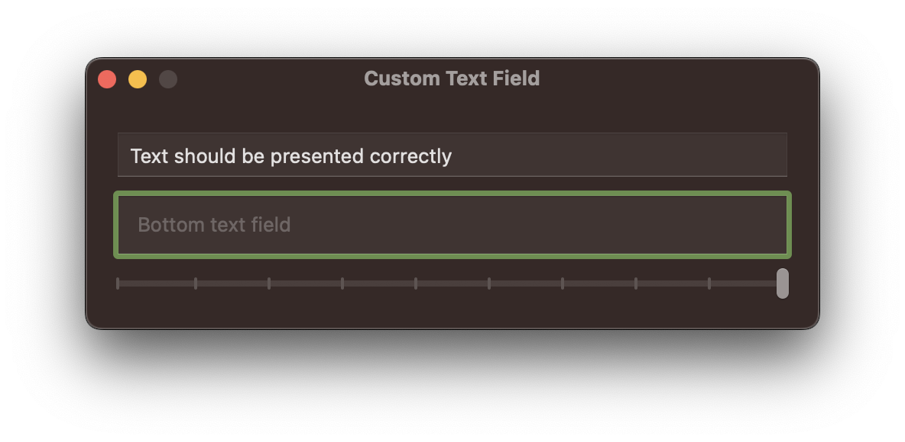

# CustomTextField

Implementing internal padding in an NSTextField

Customizing padding between the text and border in an NSTextField by overriding NSTextFieldCell.

## Requirements
Project was created using the following software

- Xcode 14.2
- Swift 5.7
- macOS 13.2 (Ventura)
